# Hangouts Chat RSS bot
A simple Google Apps Script that fetches news from an RSS feed and posts them to a Hangouts Chat room using webhooks.

This sample uses the Google Cloud Platform blog as an example.

## Create a Hangouts Chat webhook
1. (Optional) Create a new room for testing
2. Select the "Configure webhooks" menu:

    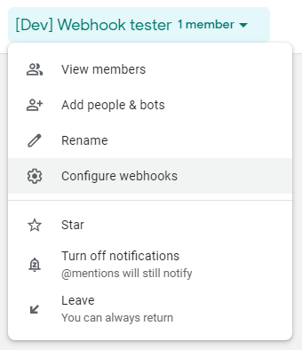

3. Create the new webhook by providing a name and an optional URL to a public image:

    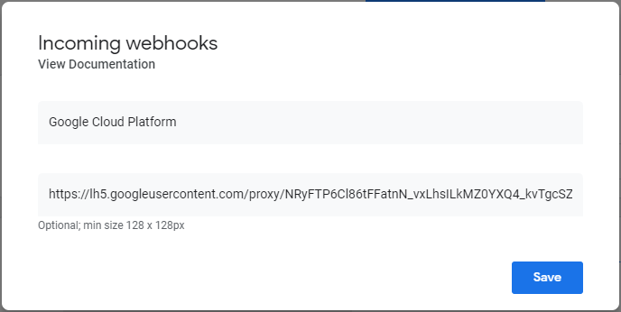

4. Once created, you will see your new webhook with it's URL. This is the URL we will use to post new messages to the room:

    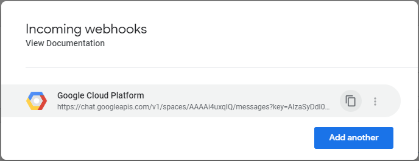

## Setup the Google Apps Script

1. Create a new Google Apps Script project
2. Copy the content of [/Code.gs](/Code.gs) (or [/Code-atom.gs](/Code-atom.gs) for Atom feeds) to a file in your Google Apps Script project
3. Update the WEBHOOK_URL variable with the URL of your webhook (see [Create a Hangouts Chat webhook](#create-a-hangouts-chat-webhook))

    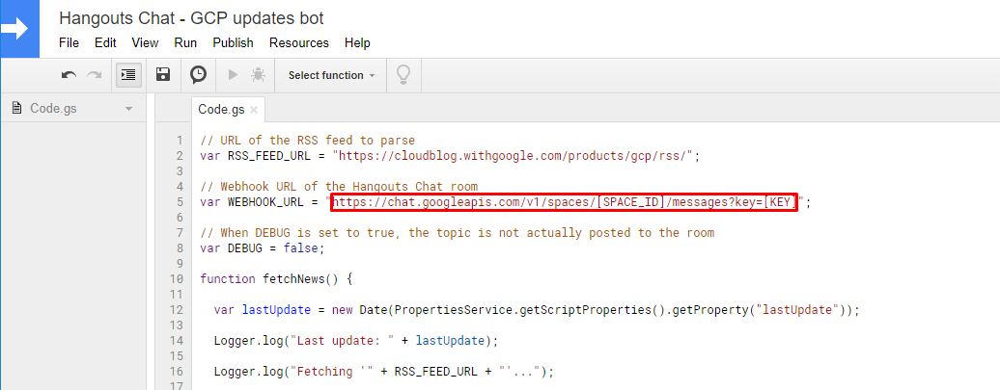

## Manually run the script
>Note that this step is required as you need to manually run the script a first time to go through the authorization process

You can easily test the script by manually running the fetchNews() function from the Google Apps Script editor:

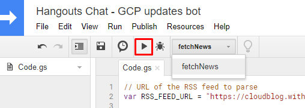

At the first execution, you will be prompted to authorize the script to send external requests.

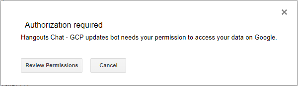

Click on "Review Permissions" and authorize the script by clicking on the "Allow" button:

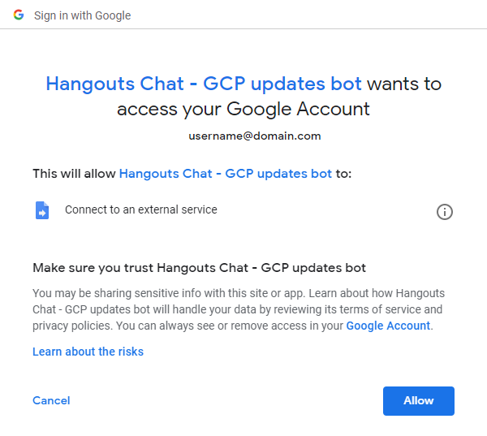

Once the script finished its execution, you should see new topics posted in your Hangouts Chat room:

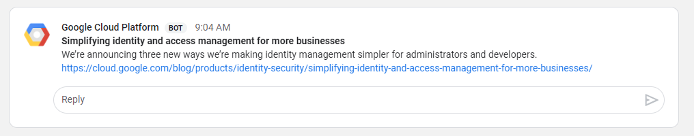

>\o/ *yay!* 

## Schedule updates
At each run, the script will parse the RSS feed and automatically post new articles that were published since it's last execution.

You can easily schedule the execution of the script at regular intervals using Time-driven triggers.

To set a new trigger, click on the Triggers icon on your Google Apps Script project:

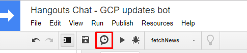

Then schedule a new Time-driven trigger to automatically execute the "fetchNews" function at a regular interval (e.g. every 10 minutes):

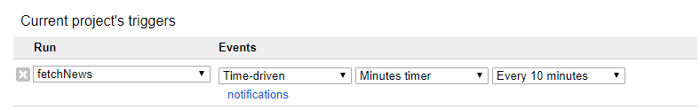

## Share your room!
Share your room to everyone in your company and react together to new exciting news!

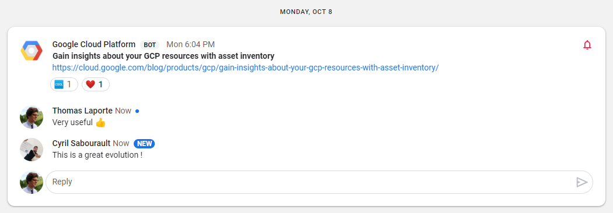